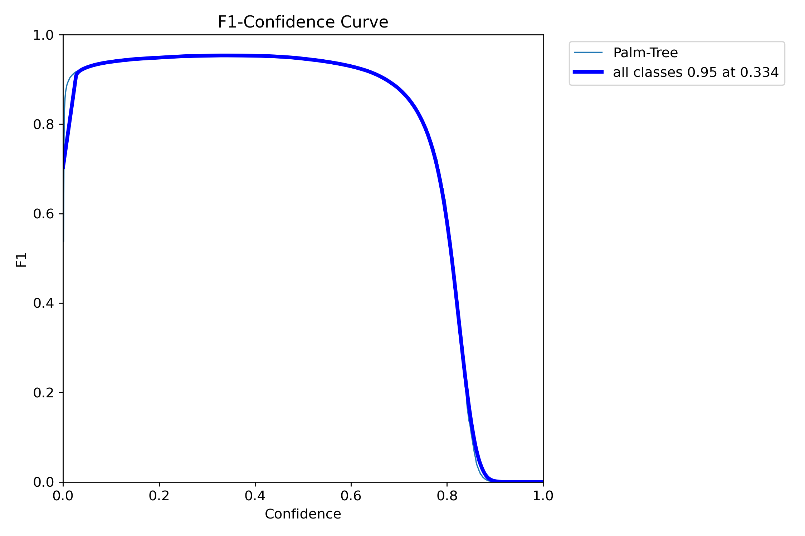
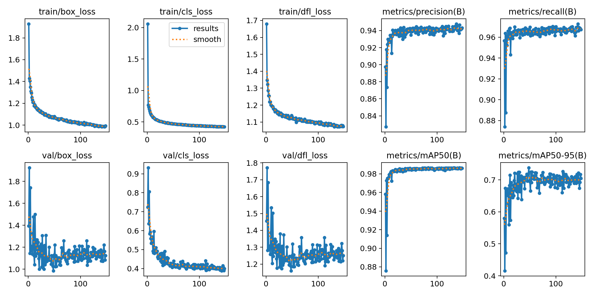

# palm.dinusantara.id

There are two projects which contains of this projects, first is about the counting palm tree based on image uploaded by users, and classifications color on an apple. 


## Authors

- [@sadewawicak25](https://sadewawicak25.medium.com/)


## Tech Stack

**Python:** v3.11

**Server:** FastAPI

**Load Balancer:** Traefik

**ML Metrics:** MLFlow


## Screenshots
- F1-Score Palm Tree



- Results Palm Tree




## Run Locally

Clone the project

```bash
  git clone https://link-to-project
```

Download datasets
```
https://drive.google.com/file/d/1t7led_uZB_UA6Va2q7TmqxCxOKk0q1O5/view?usp=sharing
```

Go to the project directory

```bash
  cd my-project
```

Install dependencies

```bash
  npm install
```

Start mlflow ui

```bash
  mlflow server --backend-store-uri runs/mlflow
```


## Lessons Learned

What did you learn while building this project? What challenges did you face and how did you overcome them?


## Features

- Light/dark mode toggle
- Live previews
- Fullscreen mode
- Cross platform


## Feedback

If you have any feedback, please reach out to us at fake@fake.com

## Color Reference

| Color             | Hex                                                                |
| ----------------- | ------------------------------------------------------------------ |
| Example Color |  #0a192f |
| Example Color |  #f8f8f8 |
| Example Color |  #00b48a |
| Example Color |  #00d1a0 |


## Usage/Examples

```javascript
import Component from 'my-project'

function App() {
  return <Component />
}
```


## Deployment

To deploy this project run

```bash
  npm run deploy
```


## Demo

Insert gif or link to demo


## API Reference

#### Get all items

```http
  GET /api/items
```

| Parameter | Type     | Description                |
| :-------- | :------- | :------------------------- |
| `api_key` | `string` | **Required**. Your API key |

#### Get item

```http
  GET /api/items/${id}
```

| Parameter | Type     | Description                       |
| :-------- | :------- | :-------------------------------- |
| `id`      | `string` | **Required**. Id of item to fetch |

#### add(num1, num2)

Takes two numbers and returns the sum.


## Support

For support, email fake@fake.com or join our Slack channel.


