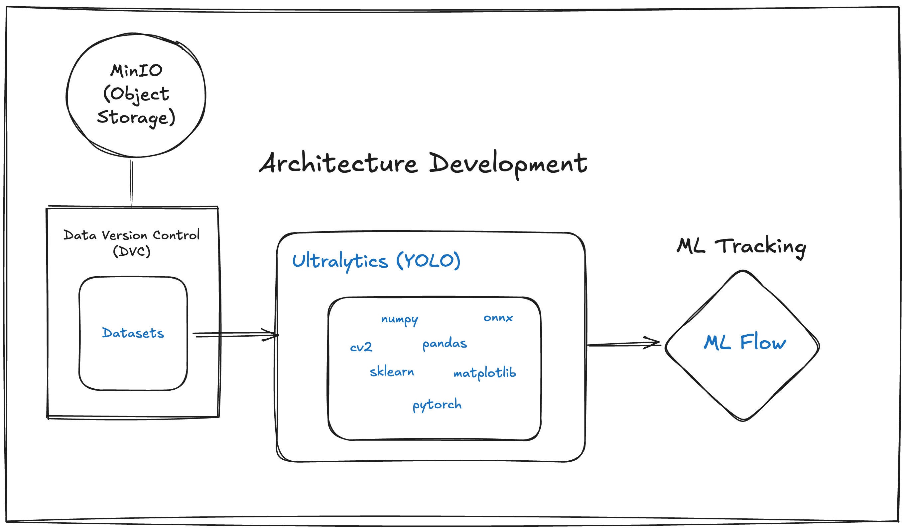
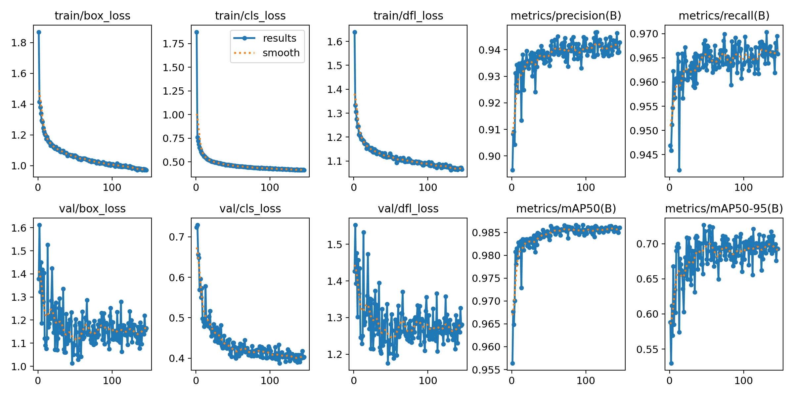
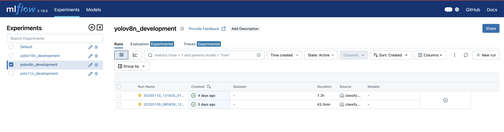
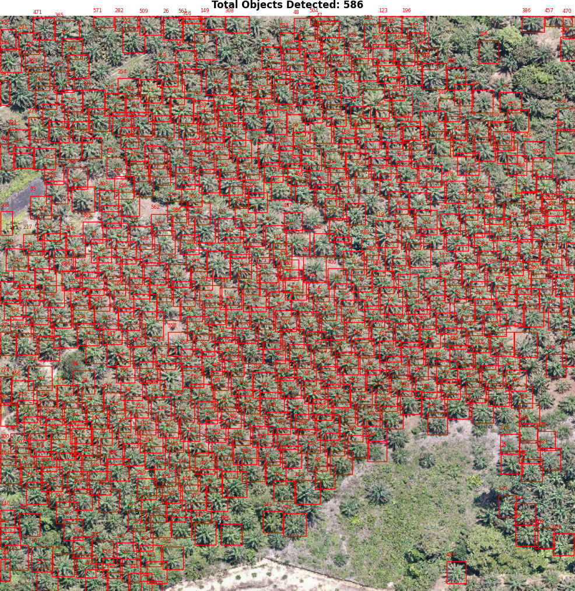
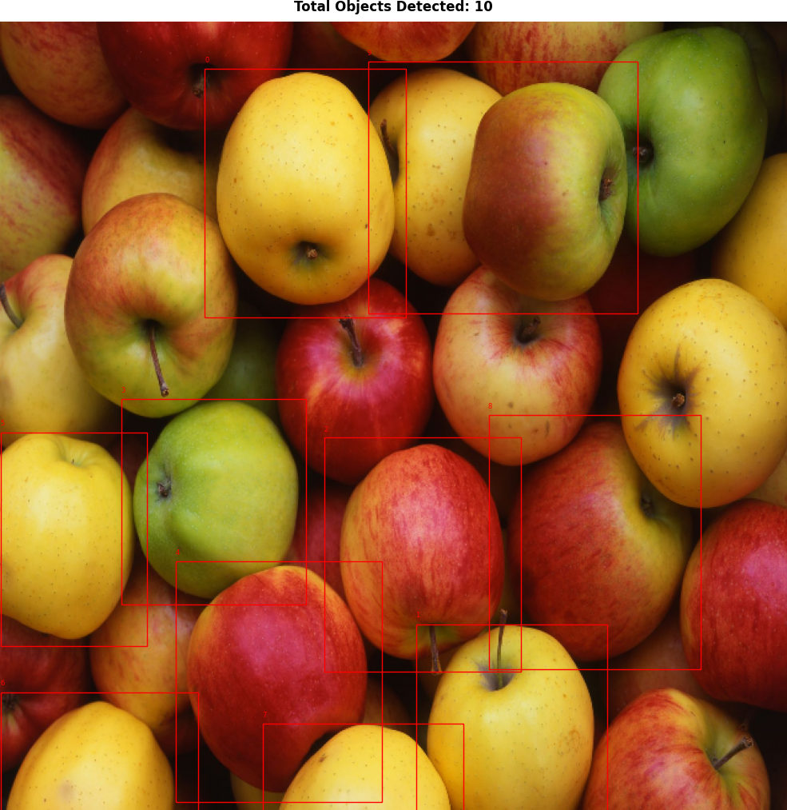
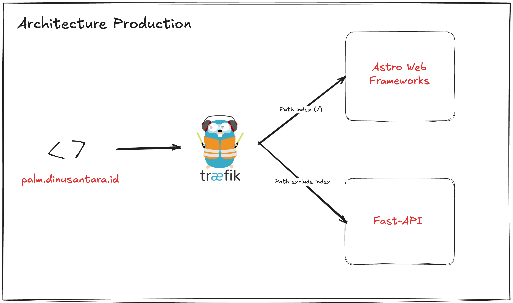
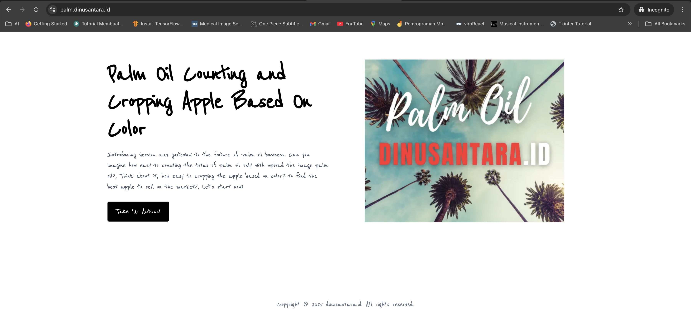

# palm.dinusantara.id 👋

There are two projects which contains of this projects, first is about the counting palm tree based on image uploaded by users, and classifications color on an apple. 


## Authors

- 😎👌🔥 [@sadewawicak25](https://sadewawicak25.medium.com/)


## Tech Stack

**Python:** v3.11

**Server:** FastAPI

**Load Balancer:** Traefik

**ML Metrics:** MLFlow

**Web Frameworks:** Astro

**NodeJS:** v20.16.0 with `pnpm`


## Development Architecture 



## Screenshots Count (YOLOv8n)




## Screenshots Classify (YOLOv11n)


## Datasets
https://drive.google.com/drive/folders/1igMurqCpRFVVZzHfSKclCBTOUZ-FI8rW?usp=sharing


## Run Locally

Clone the project

```bash
  git clone https://github.com/sadewa25/palm.dinusantara.git
```

Unzip datasets
```
Unzip the downloaded datasets into projects folder
```

Go to the project directory

```bash
  cd palm.dinusantara
```

Create Environment

```bash
  python -m venv palm_venv
```

Source Environment

```bash
  source palm_venv/bin/activate
```

Install Depedencies
```bash
  pip install -r requirements_base.txt
```

Start mlflow ui

```bash
  mlflow server --backend-store-uri runs/mlflow
```

Run Count
```bash
  python count.py
```

Run Classify
```bash
  python classify.py
```

Run FastAPI
```bash
  uvicorn api:app --reload
```


## MLFlow UI
Access on http://127.0.0.1:5000/




## Lessons Learned

💡 On this projects, I tried some architecture like YOLOv8n, YOLO10n, YOLOv9t, and YOLOv11n but based on our results the best performance is achieved from YOLOv8n and YOLOv11n.

## Configuration Architecture
To change the configuration architecture during training process just change the `config.yaml`.

| Command | Description |
| --- | --- |
| `name.model_name` | Generate folder for results Ultralytics |
| `model.name` | Architecture which is used references on https://docs.ultralytics.com/models/yolov8/#performance-metrics |
| `data_count.old` | Same it with folder name based on unzip datasets |
| `data_classify.old` | Same it with folder name based on unzip datasets |
| `train` | Configurations for training |
| `preprocessing` | Configurations for preprocessing image |


## Train
Run main command for classify
```bash
python classify.py
```

Run main command for count
```bash
python count.py
```

Chose options
```bash
1 (train all data), 2 (sampling some data), 4 
```

## Visualize
Run main command for classify
```bash
python classify.py
```

Run main command for count
```bash
python count.py
```

Chose options
```bash
3 (visualize)
```

Output folder
```bash
output/model/name
```


## Sample Output




## Docker Fast API
- Build Docker
```sh
docker build --platform linux/amd64 -f Dockerfile.API -t sadewawicak25/palm.dinusantara:latest .
```

- Run Docker Image
```sh 
docker run -d -p 8002:8002 -v yourpath:/app/static sadewawicak25/palm.dinusantara:latest
```

## Docker Documentation
- Build Docker Image
```sh
docker build --platform linux/amd64 -t sadewawicak25/palm.dinusantara-fe:latest .
```

- Run Docker Image
```sh
docker run -d -p 3002:3002 sadewawicak25/palm.dinusantara-fe:latest
```

## Requirements.txt
Generate requirements library on the project
```bash
pip freeze | sed 's/@.*//g' > requirements_api.txt
```

## Deployment Architecture


## Demo
URL
```bash
https://palm.dinusantara.id/
```



Sample Access Result
```bash
https://palm.dinusantara.id/{{response}}
```

Sample
```bash
https://palm.dinusantara.id/static/counts/detected_20250115_092955_605.jpg
```


## Support

✅ For support and feedback just email me on wicaksanasadewa@proton.me. 


