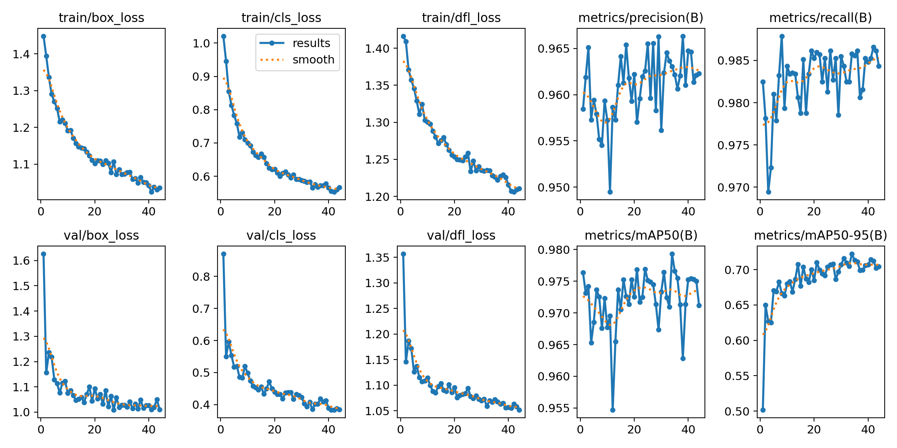

# palm.dinusantara.id

There are two projects which contains of this projects, first is about the counting palm tree based on image uploaded by users, and classifications color on an apple. 


## Authors

- [@sadewawicak25](https://sadewawicak25.medium.com/)


## Tech Stack

**Python:** v3.11

**Server:** FastAPI

**Load Balancer:** Traefik

**ML Metrics:** MLFlow


## Development Architecture 


## Screenshots Count (YOLOv8n)


## Screenshots Classify (YOLOv11n)



## Datasets
https://drive.google.com/drive/folders/1igMurqCpRFVVZzHfSKclCBTOUZ-FI8rW?usp=sharing


## Run Locally

Clone the project

```bash
  git clone https://github.com/sadewa25/palm.dinusantara.git
```

Unzip datasets
```
Unzip the downloaded datasets into projects folder
```

Go to the project directory

```bash
  cd palm.dinusantara
```

Create Environment

```bash
  python -m venv palm_venv
```

Source Environment

```bash
  source palm_venv/bin/activate
```

Install Depedencies
```bash
  pip install -r requirements_base.txt
```

Start mlflow ui

```bash
  mlflow server --backend-store-uri runs/mlflow
```

Run Count
```bash
  python count.py
```

Run Classify
```bash
  python classify.py
```

Run FastAPI
```bash
  uvicorn api:app --reload
```


## MLFlow UI
Access on http://127.0.0.1:5000/


## Lessons Learned

On this projects, I tried some architecture like YOLOv8n, YOLO10n, YOLOv9t, and YOLOv11n but based on our results the best performance is achieved from YOLOv8n and YOLOv11n.


## Train
Run main command for classify
```bash
python classify.py
```

Run main command for count
```bash
python count.py
```

Chose options
```bash
1 (train all data), 2 (sampling some data), 4 
```

## Visualize
Run main command for classify
```bash
python classify.py
```

Run main command for count
```bash
python count.py
```

Chose options
```bash
3 (visualize)
```

Output folder
```bash
output/model/name
```


## Sample Output


## Docker Fast API
- Build Docker
```sh
docker build --platform linux/amd64 -t sadewawicak25/palm.dinusantara:latest .
```

docker run -p 8002:8002 -v /Users/sadewawicak/Storage/Static:/app/static sadewawicak25/palm.dinusantara:latest


## Features

- Light/dark mode toggle
- Live previews
- Fullscreen mode
- Cross platform


## Feedback

If you have any feedback, please reach out to us at fake@fake.com


## Usage/Examples

```javascript
import Component from 'my-project'

function App() {
  return <Component />
}
```


## Deployment

To deploy this project run

```bash
  npm run deploy
```


## Requirements.txt
Generate requirements library on the project
```bash
pip freeze | sed 's/@.*//g' > requirements_api.txt
```

## Docker
Build image
```bash
docker build --platform linux/amd64 -t sadewawicak25/palm.dinusantara:latest .
```


## Demo

Insert gif or link to demo


## API Reference

#### Get all items

```http
  GET /api/items
```

| Parameter | Type     | Description                |
| :-------- | :------- | :------------------------- |
| `api_key` | `string` | **Required**. Your API key |

#### Get item

```http
  GET /api/items/${id}
```

| Parameter | Type     | Description                       |
| :-------- | :------- | :-------------------------------- |
| `id`      | `string` | **Required**. Id of item to fetch |

#### add(num1, num2)

Takes two numbers and returns the sum.


## Support

For support, email fake@fake.com or join our Slack channel.


